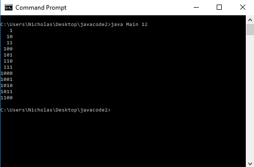
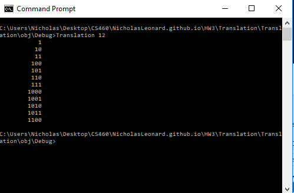
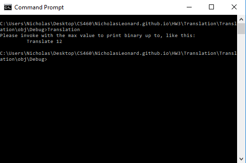
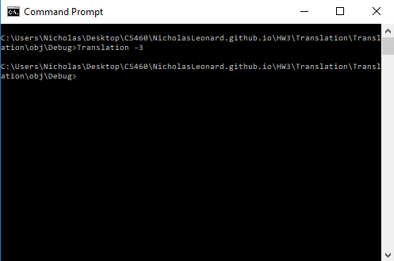

# Nicholas Leonard
<br/>
## Homework 3

For this assignment, I had to translate a simple Java application into C#, whiched turned out to be easier then I had expected. I have very little experience with Java and no experience with C#. However, it was fairly straight forward, easy to understand, and similar to Java. Once more, it was a new and fun experience. And I enjoyed experimenting with C# so that I could learn it and utilize it.

### Important Links
Here is the link to my github repository that holds all of the source files for this assignment and others.<br/>
[Github Repository](https://github.com/NicholasLeonard/NicholasLeonard.github.io)<br/>

Here is the link to take you back to the home page of my Portfolio.<br/>
[Home](../index.md)

### Step 1. Setting up my IDE (Integrated Development Environment)

This assignment presented the first oppertunity for me to use an IDE for the class. The IDE that I used was Visual Studio 2017 Community addition. As part of the instaltion process, I also installed several extensions and workspaces that would allow me to use Visual Studio 2017 to work with C#, the .NET Framework, and several other program types.

### Step 2. Run the Java Program

Before I could start translating the Java code, I had to run the program and see what it actually did. So, using a Windows Command Prompt, I navigated to the folder containing the Java files and compiled and ran the program with an input of 12.

<br/>

I then tried running it without giving it an argument to see what would happen. It returned a string to the console with an example of how to properly run the program.


To further test the program, I ran it with a string instead of a number and I tried inputting a negative number. The program displayed a string saying that it did not recognize the input number when I entered the string and it seemed to have no response for a negative number input except to crash.


### Step 3. Translating the program into C#.

Before doing this homework assignment, I had worked with very little Java and I had never touched C#. However, I was able to effectively work out the translation from Java to C# and I actually really like C#. I like its simplicity and format as well as the strength of its type safety. 

#### Node File

I started with the Node class. Because C# contains a lot of similarities to Java, the only real difference between the Java file and the C# file were the nameing conventions, such as capitalization of public variables and methods, the format of the XML comments, and the use of a namespace in C#. I started by just translating the code and then came back later to add the XML comments from the Java file to the C# file.

```java
/** Singly linked node class. (Java)*/

public class Node<T>
{
	public T data;
	public Node<T> next;
	
	public Node( T data, Node<T> next )
	{
		this.data = data;
		this.next = next;
	}
}
```
```csharp
namespace Translation
{
    /// <summary>
    /// Node class for a singly linked list.
    /// </summary>
    /// <typeparam name="T"></typeparam>
    public class Node<T>
    {
    
        public T Data;
        public Node<T> Next;
        /// <summary>
        /// Constructor for assigning data value and pointer for linked list.
        /// </summary>
        /// <param name="Data"></param>
        /// <param name="Next"></param>
        public Node( T Data, Node<T> Next )
        {
            this.Data = Data;
            this.Next = Next;
        }
    }
}
```

#### QueueInterface File

After I finished the Node file, I moved to the QueueInterface Java file. Once again, there were a lot of similarities between the Java code and the C# code. The only real difference was that the initialized `pop()` function in the Java code had a `throws QueueUnderFlowException`, which cannot be done in C#. The exception can still be thrown, that particular piece of code just cannot be in the initialzation of the function in C#. The other big difference was the naming convention. In C#, interfaces declerations begin with an I, so I changed the name of the interface to IQueueInterface and I capitalized the methods to keep inline with C# naming conventions. The other difference was the variable type for a boolean value is bool in C# rather than boolean in Java.

```java
/**
 * A FIFO queue interface.  This ADT is suitable for a singly
 * linked queue. (Java)
 */
public interface QueueInterface<T>
{
    /**
     * Add an element to the rear of the queue
     * 
     * @return the element that was enqueued
     */
    T push(T element);

    /**
     * Remove and return the front element.
     * 
     * @throws Thrown if the queue is empty
     */
    T pop() throws QueueUnderflowException;

    /**
     * Test if the queue is empty
     * 
     * @return true if the queue is empty; otherwise false
     */
    boolean isEmpty();
}
```

```csharp
namespace Translation
{/// <summary>
/// Interface for different queue types.
/// </summary>
/// <typeparam name="T"></typeparam>
    public interface IQueueInterface<T>
    {
        /// <summary>
        /// Add an element to the rear of the queue and return the element that was enqueued.
        /// </summary>
        /// <param name="element"></param>
        /// <returns></returns>
        T Push(T element);

           /// <summary>
           /// Remove and return the front element and throws a QueueUnderFlowException if the queue is empty.
           /// </summary>
           /// <returns></returns>
        T Pop();

        /// <summary>
        /// Test if the queue is empty. Return true if the queue is empty; false otherwise.
        /// </summary>
        /// <returns></returns>
        bool IsEmpty();
    }
}
```

#### QueueUnderFlowException File
Next up was the QueueUnderFlowException Java file. For this file, I had to use class inheritance. User defined exceptions have to inherit properties from the general exceptions class in C#. So I just used the inheritance character `:` to declare the classes in this file. Java also uses `super()` while C# uses `base`. So I used inheritance for that as well. I also had to include `using System;` in order to access the general Exception and base classes.

```java
/**(java)
 * A custom unchecked exception to represent situations where 
 * an illegal operation was performed on an empty queue.
 */
public class QueueUnderflowException extends RuntimeException
{
  public QueueUnderflowException()
  {
    super();
  }

  public QueueUnderflowException(String message)
  {
    super(message);
  }
}
```

```csharp
namespace Translation
{    /// <summary>
    /// A custom exception to represent situations where an illegal operation was performed on an empty queue.
    /// </summary>
    public class QueueUnderFlowException : Exception
    {//user made exception with no message.
        public QueueUnderFlowException() : base()
        {
        }

        //user made exception that displays a message.
        public QueueUnderFlowException(string message) : base(message)
        {
        }
    }
}
```

#### LinkedQueue File

The next file I worked on was the LinkedQueue file. There were no big differences between the Java and C# files. However, there were a few things like C#'s `NullReferenceException` instead of Java's `NullPointerException` and the difference in the naming conventions between Java and C#. There was one significant difference between the two files in that C# does not allow generic types to be set to null. So in the pop function for the C# code, I had to use C#'s `default()` function and pass it the generic type `T` in order to achieve the same result as setting `T tmp = null` in the Java code. The way that the `default()` function works, is that once the class is declared with a specific type, it will set the default null value for that type. Thus, it sets value types to 0, reference types to null, and boolean types to false. I found this specific C# quirk interesting and kind of cool.

```java
/**(java)
 * A Singly Linked FIFO Queue.  
 * From Dale, Joyce and Weems "Object-Oriented Data Structures Using Java"
 * Modified for CS 460 HW3
 * 
 * See QueueInterface.java for documentation
 */

public class LinkedQueue<T> implements QueueInterface<T>
{
	private Node<T> front;
	private Node<T> rear;

	public LinkedQueue()
	{
		front = null;
		rear = null;
	}

	public T push(T element)
	{ 
		if( element == null )
		{
			throw new NullPointerException();
		}
		
		if( isEmpty() )
		{
			Node<T> tmp = new Node<T>( element, null );
			rear = front = tmp;
		}
		else
		{		
			// General case
			Node<T> tmp = new Node<T>( element, null );
			rear.next = tmp;
			rear = tmp;
        }
        return element;
	}     

	public T pop()
	{
		T tmp = null;
		if( isEmpty() )
		{
			throw new QueueUnderflowException("The queue was empty when pop was invoked.");
		}
		else if( front == rear )
		{	// one item in queue
			tmp = front.data;
			front = null;
			rear = null;
		}
		else
		{
			// General case
			tmp = front.data;
			front = front.next;
		}
		
		return tmp;
	}

	public boolean isEmpty()
	{              
		if( front == null && rear == null )
		{
			return true;
		}
		else
		{
			return false;
		}
	}
}
```

```csharp
using System;

namespace Translation
{/// <summary>
/// FIFO Queue that implements IQueueInterface.
/// </summary>
/// <typeparam name="T"></typeparam>
    public class LinkedQueue<T>:IQueueInterface<T>
    {
        private Node<T> front;
        private Node<T> rear;

       public LinkedQueue()
        {
            front = null;
            rear = null;
        }
        /// <summary>
        /// Used to push new elements into the queue.
        /// </summary>
        /// <param name="element"></param>
        /// <returns></returns>
        public T Push(T element)
        {
            if( element == null )
            {
                throw new NullReferenceException();
            }

            if ( IsEmpty() )
            {//creates first node in queue
                Node<T> tmp = new Node<T>(element, null);
                rear = front = tmp;
            }
            else
            {
                //General case
                Node<T> tmp = new Node<T>(element, null);
                rear.Next = tmp;
                rear = tmp;
            }
            return element;
        }

        /// <summary>
        /// Used to remove elements from the queue.
        /// </summary>
        /// <returns></returns>
        public T Pop()
        {//C# quirk, Genenric types cannot equal null. Use default to set null values for all types.
            T tmp = default(T);
            if(IsEmpty())
            {
                throw new QueueUnderFlowException("The queue was empty when pop was invoked.");
            }
            else if( front == rear)
            {// one item in queue
                tmp = front.Data;
                front = null;
                rear = null;
            }
            else
            {// General case
                tmp = front.Data;
                front = front.Next;
            }

            return tmp;
        }

        /// <summary>
        /// Tests if the queue is empty.
        /// </summary>
        /// <returns></returns>
        public bool IsEmpty()
        {
            if( front == null && rear == null)
            {
                return true;
            }
            else
            {
                return false;
            }
        }
    }
}
```

#### Main File

The last file to translate was the Java main file. This file contained the most differences between the C# and Java verisons. The only main (heh) difference between the two in the first function definition was when a new binary number was added to the list, Java used `add()` and I had to use `AddLast()` for the C# version. Again, I had to observe proper C# naming conventions with capitalization for methods and variables but short of that, the first parts of the files were very similar. The big differences between the two files came in the Main driver function for the GenerateBinaryRepresentationList function. To write to the console, Java uses `System.out.println()` and `System.out.print()` but for C# I had to use `Console.WriteLine()` and `Console.Write()` respectively. Later, I had to use C#'s `Count()` instead of Java's `getLast().length()` to determine the length of the linked list returned by GenerateBinaryRepresentationList. The syntax and method for parsing the input is a little different in C# then in Java so I had to change that too. The only other difference was that I had to use a `foreach` and `for` loop instead of the two `for` loops in the Java code.

```java
java.util.LinkedList; 

public class Main  
{ 
    /**
     * Print the binary representation of all numbers from 1 up to n.
     * This is accomplished by using a FIFO queue to perform a level 
     * order (i.e. BFS) traversal of a virtual binary tree that 
     * looks like this:
     *                 1
     *             /       \
     *            10       11
     *           /  \     /  \
     *         100  101  110  111
     *          etc.
     * and then storing each "value" in a list as it is "visited".
     */
    static LinkedList<String> generateBinaryRepresentationList(int n) 
    { 
        // Create an empty queue of strings with which to perform the traversal
        LinkedQueue<StringBuilder> q = new LinkedQueue<StringBuilder>(); 

        // A list for returning the binary values
        LinkedList<String> output = new LinkedList<String>();
        
        if(n < 1)
        {
            // binary representation of negative values is not supported
            // return an empty list
            return output;
        }
          
        // Enqueue the first binary number.  Use a dynamic string to avoid string concat
        q.push(new StringBuilder("1")); 
          
        // BFS 
        while(n-- > 0) 
        { 
            // print the front of queue 
            StringBuilder sb = q.pop(); 
            output.add(sb.toString()); 
            
            // Make a copy
            StringBuilder sbc = new StringBuilder(sb.toString());

            // Left child
            sb.append('0');
            q.push(sb);
            // Right child
            sbc.append('1');
            q.push(sbc); 
        }
        return output;
    } 
      
    // Driver program to test above function 
    public static void main(String[] args)  
    { 
        int n = 10;
        if(args.length < 1)
        {
            System.out.println("Please invoke with the max value to print binary up to, like this:");
            System.out.println("\tjava Main 12");
            return;
        }
        try 
        {
            n = Integer.parseInt(args[0]);
        } 
        catch (NumberFormatException e) 
        {
            System.out.println("I'm sorry, I can't understand the number: " + args[0]);
            return;
        }
        LinkedList<String> output = generateBinaryRepresentationList(n);
        // Print it right justified.  Longest string is the last one.
        // Print enough spaces to move it over the correct distance
        int maxLength = output.getLast().length();
        for(String s : output)
        {
            for(int i = 0; i < maxLength - s.length(); ++i)
            {
                System.out.print(" ");
            }
            System.out.println(s);
        }
```

```csharp
using System;
using System.Collections.Generic;
using System.Text;
using System.Linq;

namespace Translation
{/// <summary>
/// A class that contains the driving program and the generation program for the binary representation of numbers.
/// </summary>
    public class MainProgram
    {
        /// <summary>
        /// Print the binary representation of all numbers from 1 up to n. This is accomplished by using a FIFO queue to perform a level order(i.e.BFS) traversal of a virtual binary tree and then storing each "value" in a list as it is "visited".
        /// </summary>
        /// <param name="n"></param>
        /// <returns></returns>
        static LinkedList<string> GenerateBinaryRepresentationList(int n)
        {
            //Create an empty queue of strings with which to perform the traversal.
            LinkedQueue<StringBuilder> q = new LinkedQueue<StringBuilder>();

            //A list for returning the binary values
            LinkedList<string> output = new LinkedList<string>();

            if(n < 1)
            {
                //binary representation of negative values is not suppported return an empty list
                return output;
            }

            //Enqueue the first binary number. Use a dynamic string to avoid string concat
            q.Push(new StringBuilder("1"));

            //BFS
            while(n-- > 0)
            {
                //print the font of queue. possibly put try catch here.
                StringBuilder sb = q.Pop();
                output.AddLast(sb.ToString());

                //make a copy
                StringBuilder sbc = new StringBuilder(sb.ToString());

                //Left child
                sb.Append("0");
                q.Push(sb);
                //Right child
                sbc.Append("1");
                q.Push(sbc);
            }
            return output;
        }

        //Driver program to test above function
        /// <summary>
        /// Driver function for GenerateBinaryRepresentationList function.
        /// </summary>
        /// <param name="args"></param>
        static void Main(string[] args)
        {
            int n = 10;
            if(args.Length < 1)
            {
                Console.WriteLine("Please invoke with the max value to print binary up to, like this:");
                Console.WriteLine("\t Translate 12");
                return;
            }
            try
            {
                n = Int32.Parse(args[0]);
            }
            catch(FormatException)
            {
                Console.WriteLine("I'm sorry, I can't understand the number: " + args[0]);
                return;
            }
            LinkedList<string> output = GenerateBinaryRepresentationList(n);
            //Print it right justified. Longest string is the last one.
            //Print enough spaces to move it over the correct distance.
            int maxLength = output.Count();
            foreach (string s in output)
            {
                for(int i = 0; i < maxLength - s.Length; ++i)
                {
                    Console.Write(" ");
                }
                Console.WriteLine(s);
            }
        }
    }
}
```

### Testing the C# Program

After I finished translating the code, I had to test the C# program to see if it produced the same result as the Java code. So I opened a new Windows Command Console and navigated to the Debug folder that contained the executable file. I started by running the program with an input of 12 like I did with the Java program, which returned a tree similar to the Java program. The C# version tabs over the output a little more than the Java program but it still produced the same values, which is truly what I was going for.



Next, I tried running it with no input to see if it would display the example message to the console. It worked like a charm.



Then I ran the program with a string input rather than a number to see what would happen. As expected, it told me that it did not recognize the number that I gave it, just like it did in the Java program. Score!


For the final test, I tried inputting a negative number and it returned an empty string, which is what is should have done because this program does not support the representation of negative numbers in binary.



And that is the new program! Pretty cool right?