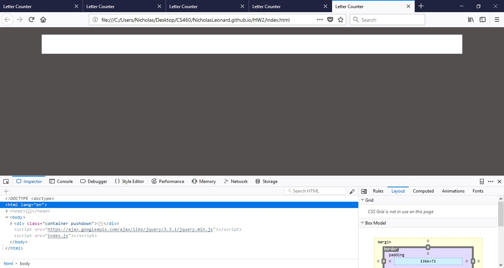
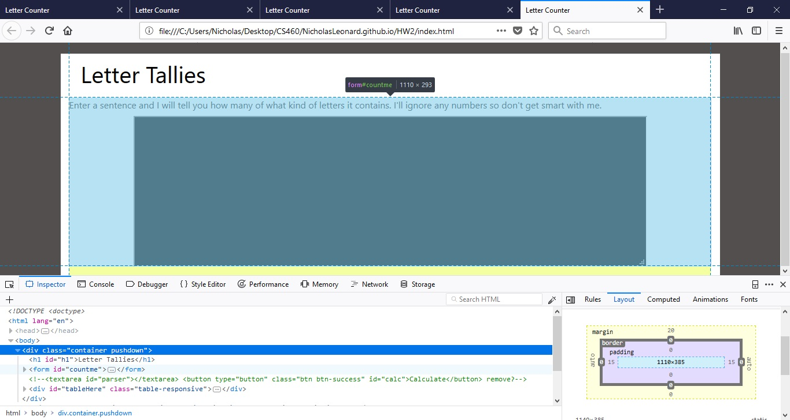
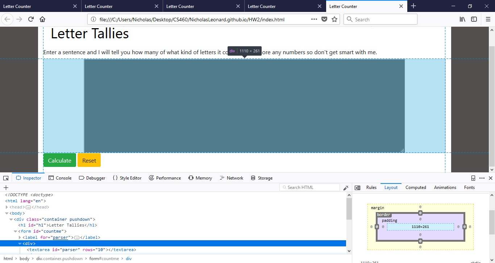
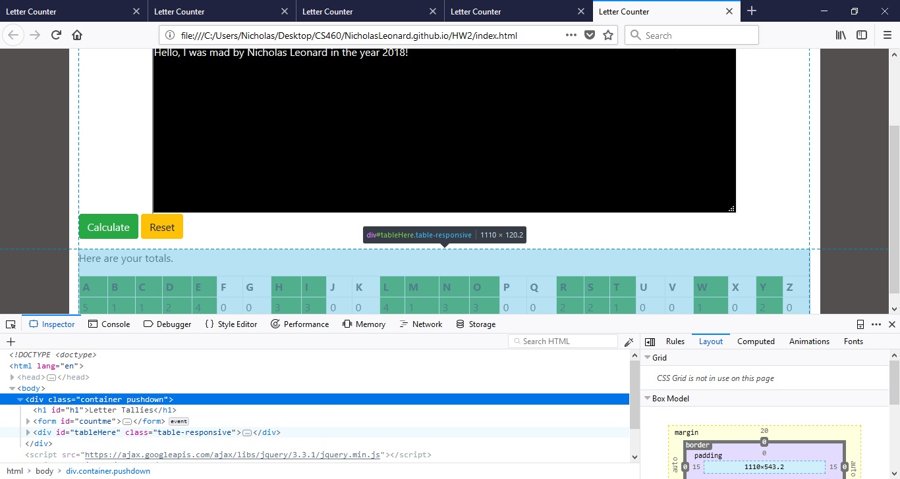

# Nicholas Leonard
<br/>
## Homework 2

Once again, I have never used javaScript or jQuery before but I found the process fun and fairly straight forward. For this assignment, I had to make another webpage and then use javascript and jquery to modify it in some way. Therefore, I decided to do a letter counter that would take an input string from the user and then return a jquery generated table with the total counts of each letter used. I had a lot of fun doing it and it turned out pretty well. I also had to use a seperate branch in git to do this "feature" and then merge it back into the main branch when we were finished. That was cool because I got some experience with branching and actual work flow control.

### Important Links
Here is the link to my github repository that holds all the source code for this assignment.<br/>
[Github Repository](https://github.com/NicholasLeonard/NicholasLeonard.github.io)

This is the link to the page that I made for this assignment. Please, give it a try.<br/>
[Letter Counter](index.html)

This link will take you back to my home Portfolio page.<br/>
[Home](../index.md)

<br/>
### Step 1. Creating a new feature branch in git for Hwk2.

The first thing I had to do was create a new branch to work on so I could git (hehe) some experience with branching and to keep this work from contaminating everything I had done before. So using the git branching command, I created a new branch and checked it out so that I could work on that branch instead of the master branch.
```bash
git branch hw2

git checkout hw2
```

<br/>
### Step 2-3. Planning and Design

After I created the new working branch and checked it out, I had to decide what it was I wanted to do and if I was going to add it to my original website. I decided not to add it to the website I made for assignment 1 because I wanted to keep each assignment isolated so that they could be shown individually. I did, however, decide to use most of the stylings in my CSS file from the original website.

Once I decided that I was not going to add it to the first website, I had to decide what I was going to do. The requirement was that it had to read input from the user in some way and then display something. I had to do this by using javascript and jquery to modify existing elements and add new elements to the page. I decided to create a simple tallier that would read in an input string from the user and then generate a table that showed the total number of each letter that was used in the string.

I also had to consider how I wanted to design the site. I decided to just have one main container with the input area in a form and the table appearing in a <code><div></code> element beneath the form.



After I had the initial container, I would use a header tag to put a title for the following elements.


Then I wanted to add the actual form with a text area type input to allow the user to enter an unlimited number of characters as apposed to the 20 or so limit with a standared form input element. I also wanted to add a caption to the form with an instructional message to the user.



I also wanted to add two buttons to the form for submitting it to begin the calculation and a reset button to allow the user to enter a new input string. I also wanted to style these buttons using Bootstrap 4 to make them a little more interesting.



I had originally thought to have the input box in a left column and generate the table in a right column, but I decided it would be better to utilize a vertical alignment. Thus, I decided to have the input area at the top of the page and have the table appear beneath it. I also wanted to highlight the letters that the user actually used so I wanted to use Bootstrap 4 to add some table highlights.



<br/>
### Step 4. Coding the page in HTML, styling with CSS, and using JavaScript and JQuery to modify

After I finished designing the page and coming up with ideas, it was time to begin coding. I started with the main container, the title header, and the input form. As I stated earlier, I wanted a textarea input element because it allows for more input then the standared input element. I used CSS to style the input area extensively and I will talk about that later but I did have to specify the number of rows for the text area in the tag. I also added two Bootstrap 4 form buttons for submitting the form and beginning and the calcualtion as well as a reset button to put the entire page back to its original state.

```html
<body>
    <div class="container pushdown">
            <h1 id="h1">Letter Tallies</h1>
                <form id="countme">
                    <label for="parser">Enter a sentence and I will tell you how many of what kind of letters it contains. I'll ignore any numbers so don't get smart with me.</label>
                    <div>
                        <textarea rows="10" id="parser"></textarea>
                    </div>
                    <button type="submit" class="btn btn-success" id="calc">Calculate</button>
                    <button type="reset" class="btn btn-warning" id="reset">Reset</button>
                </form>
```

After I had made the initial form, I had to create a new <code><div></code> element to put the generated table in. I kept it in the same container as the form so that it would just expand down the page as the table was made. I had to give the element an id so that I could reference it in my javascript and jquery to add the table later on.
```html
<div class="container pushdown">
            <h1 id="h1">Letter Tallies</h1>
                <form id="countme">
                    <label for="parser">Enter a sentence and I will tell you how many of what kind of letters it contains. I'll ignore any numbers so don't get smart with me.</label>
                    <div>
                        <textarea rows="10" id="parser"></textarea>
                    </div>
                    <button type="submit" class="btn btn-success" id="calc">Calculate</button>
                    <button type="reset" class="btn btn-warning" id="reset">Reset</button>
                </form>
               
                <div class="table-responsive" id="tableHere">

                </div>
        </div>
        
    </div>
```

I also had to make sure that the <code><body></code> element had the scripts to jquery and my javascript files so that the page could be modified. I decided to use a CDN to load the jquery rather than hosting it my self.

```html
<script src="https://ajax.googleapis.com/ajax/libs/jquery/3.3.1/jquery.min.js"></script>
  <script src="index.js"></script>
</body>
```
I used a CSS file to style my page. The main stylings I copied over from the file I used for my previous webpage, however, I added several other stylings for specific elements of this page. I used the CSS mainly to style the input text area to look like a DOS command shell, which I thought was pretty cool. I also used the CSS to position the input area in the middle of the page and to mess with its size. I added some padding to other elements and specifically created one class to use with my table so that I could highlight specific cells.

```css
/*Styling for wk2webpage*/

/*id for one trick header*/
#h1{
    color: black;
    padding: 10px;
    text-indent: 10px;
}


.container{
    background-color: white;    
}

/*Additional padding for the container div holding the parser form*/
#parscontainer{
    padding-bottom: 40px;
}

/*styles the input textarea*/
#parser{
    margin: 0 auto;
    display: block;
    width: 80%;
    background-color: black;
    color: white;
}

/*highlighting cells that have letters in result table*/
.have{
    background-color: green;
    color: black
}
```

### JavaScript and JQuery

Once I had coded the page and styled it, I had to write my javascript and JQuery to modify the page. I used jQuery primarily for actions and javascript for functions. I started by waiting for an event on the submit button of the form. However, when I was testing the site it would generate a table each time but not clear the one from before, so I had to add a jQuery event, which cleared the table.

```javascript
$(document).ready(function(){
    $("#countme").submit(clr_tble);
    $("#countme").submit(getString); //start calculation once the form is submitted.
    $("#reset").click(clr_tble); //this is to clear the table from a previous entry or a reset.
});
```