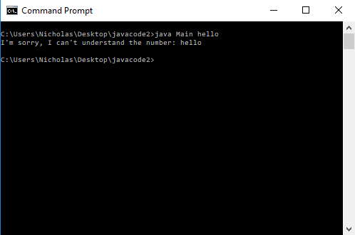

# Nicholas Leonard
 
## Homework 3

For this assignment, I had to translate a simple Java application into C#. This process turned out to be easier then I had expected. I have very little experience with Java and no experience with C#. However, it was straight forward enough for me to understand and it was very similar to Java. Once more, it was a new and fun experience for me to work with and experiment with C# so that I could develop my understanding of it.

### Important Links
Here is the link to my github repository that holds all of the source files for this assignment and others. 
[Github Repository](https://github.com/NicholasLeonard/NicholasLeonard.github.io) 

Here is the link to take you back to the home page of my Portfolio. 
[Home](../index.md)

### Step 1. Setting up my IDE (Integrated Development Environment)

This assignment presented the first oppertunity for me to use an IDE for the class. The IDE that I used was Visual Studio 2017 Community addition. I also went through and installed several extensions that allow Visual Studio 2017 to work with C# and the .NET Framework.

### Step 2. Run the Java Program

Before I could start translating the Java code, I had to run the program and see what it actually does. So, using a Windows Command Prompt, I navigated to the folder containing the Java files and ran the program with an input of 12.

I then tried running it without giving it an argument to test the program and see what would happen.

To further test the program, I ran it with a string instead of a number and I tried running it with a negative number.

