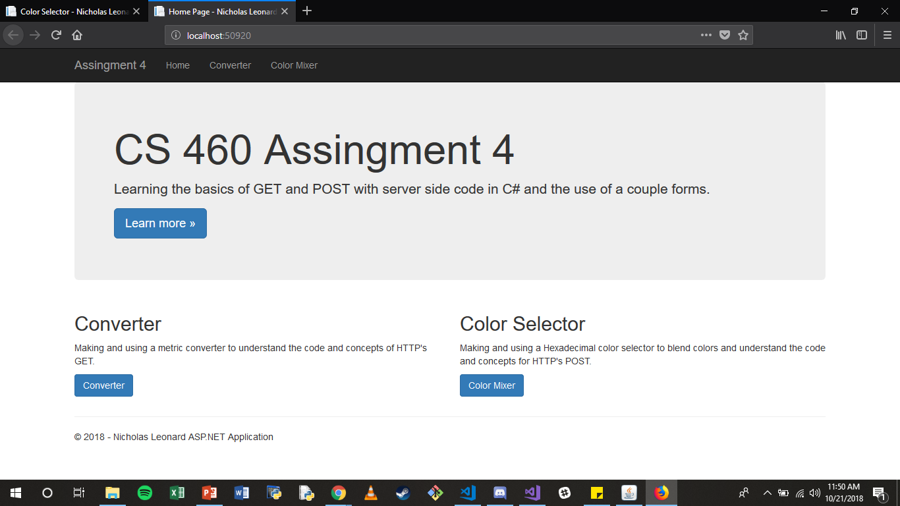

# Nicholas Leonard
<br/>
## Homework 4

This assignment was all about MVC and HTTP's GET and POST methods. To complete this assignment, I had to utilize tools and languages that I had been learning throughout this entire term as well as some new ones like HTML's Razor helper functions. I really enjoyed this project. I found learning how the GET and POST methods work really interesting and I thought the two tasks I had to do to demeonstrate there use was fun and interesting.

### Important Links
Here is the link to my github repository, which houses all of the source code for this assignment and others. <br/>
[Github Repository](https://github.com/NicholasLeonard/NicholasLeonard.github.io)<br/>

Here is a link to a video, which demos the pages that I created for this assignment.<br/>
[Assignment 4 Demo](https://www.youtube.com/watch?v=WraBgHU4vdU)<br/>

This link will take you back to my main portfolio page.
[Home](../index.md)

### Step 1. Creating a new MVC Project and Learning the Design Layout

Assignment 4 involved learning GET and POST by building a new Method View Controller (MVC) and having two views that did different things using those HTTP methods. The first thing I had to do was create a new MVC project in Visual Studio. After I created a new MVC .NETFRAMEWORK project, I had to go through the folders and files it created to learn the layout and what did what.

### Step 2. Creating the Landing Page

Once I figured out what all the files and folders were and how they worked, I went to work constructing the actual application. Visual Studio is nice in that when it created the new project, it defined a predetermined layout and style so I just modified the landing page to suit my needs. I added new descriptions and titles to the section heads and modified the effects of the buttons.

```html
@{
    ViewBag.Title = "Home Page";
}

<div class="jumbotron">
    <h1>CS 460 Assingment 4</h1>
    <p class="lead">Learning the basics of GET and POST with server side code in C# and the use of a couple forms.</p>
    <p><a href="https://www.wou.edu/~morses/classes/cs46x/assignments/HW4_1819.html" class="btn btn-primary btn-lg">Learn more &raquo;</a></p>
</div>

<div class="row">
    <div class="col-md-6">
        <h2>Converter</h2>
        <p>
            Making and using a metric converter to understand the code and concepts of HTTP's GET.
        </p>
        <p><a class="btn btn-primary" @Html.ActionLink("Converter","Converter","Home") </a></p>
    </div>
    <div class="col-md-6">
        <h2>Color Selector</h2>
        <p>Making and using a Hexadecimal color selector to blend colors and understand the code and concepts for HTTP's POST.</p>
        <p><a class="btn btn-primary" @Html.ActionLink("Color Mixer","Create","Color") </a></p>
        
    </div>
</div>
```




### Step 3. The Converter

Once the landing page was done, I moved on to the Converter page because it was going to use the same controller as the landing page. On this page, I used plain old HTML to structure the page and make the form for the input. The form on this page used GET to request from the server and passed data via query strings in the URI. The form element I created called the GET Converter action method that was in the Home Controller. I used two medium coloumns in this form to put the mile input and error text on one side and the radio buttons for the metric unit to convert to in another coloumn. I also had to add required to the miles input box to provide validation and I also had to set the type to number in order to prevent the user from sending strings to the server.

```html
<div class="row">
    <form action="/Home/Converter" method="get">
        <div class="col-md-6 form-group">
            <!--Input box for the number of miles to convert-->
            <label for="Miles">Miles</label>
            <input class="form-control" type="number" name="Miles" step=".001" required/>
            <!--Displays custom error messages for invalid query string inputs-->
            <p class="error">@ViewBag.Error @ViewBag.NoMetric</p>
          
        </div>
        <div class="col-md-6 form-group">
            <h3>Metric Units</h3>
            <hr /><!--Radio buttons for metric measurment to convert to-->
            <div class="form-check">
                <input class="form-check-input" type="radio" name="Units" value="Millimeters"/>
                <label class="form-check-label" for="Millimeters">Millimeters</label>
            </div>
            <div class="form-check">
                <input class="form-check-input" type="radio" name="Units" value="Centimeters"/>
                <label class="form-check-label" for="Centimeters">Centimeters</label>
            </div>
            <div class="form-check">
                <input class="form-check-input" type="radio" name="Units" value="Meters"/>
                <label class="form-check-label" for="Meters">Meters</label>
            </div>
            <div class="form-check">
                <input class="form-check-input" type="radio" name="Units" value="Kilometers" checked/>
                <label class="form-check-label" for="Kilometers">Kilometers</label>
            </div>
            <button class="btn btn-primary" type="submit">Convert</button>
        </div>
    </form>
</div>
```

### Step 3-2 The Converter Action Method

Once I had designed the page and created the form, I had to write the code for the action method so the server would know what to do with the data it was passed. I first had to get the data out of the query strings. I accomplished this by creating two string variables and calling the Controller `Request` method to get the data out of the query strings.
```csharp
[HttpGet]
        public ActionResult Converter()
        {//Local variables that contain the results of the query strings from the page.
            string MileInput = Request.QueryString["Miles"];
            string Units = Request.QueryString["Units"];
```